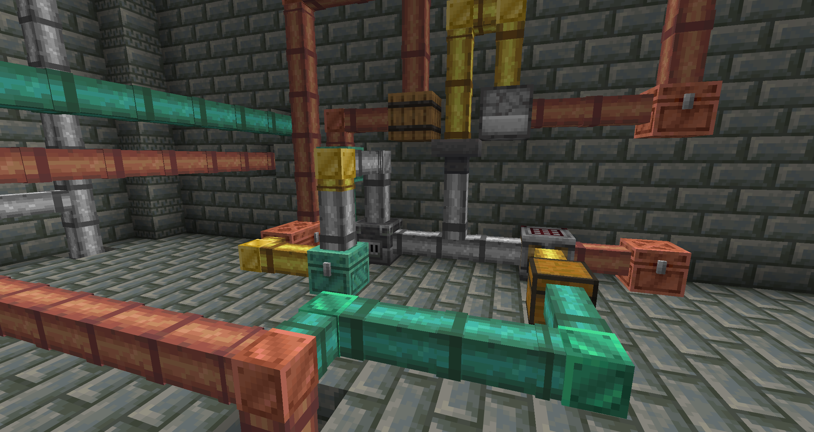
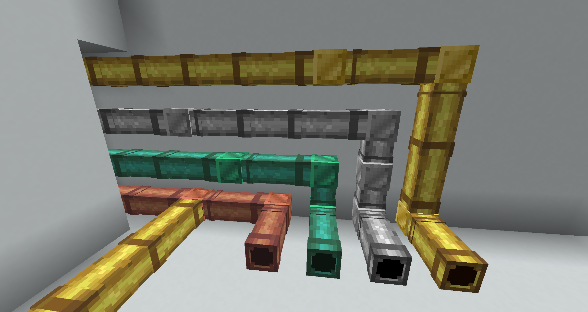
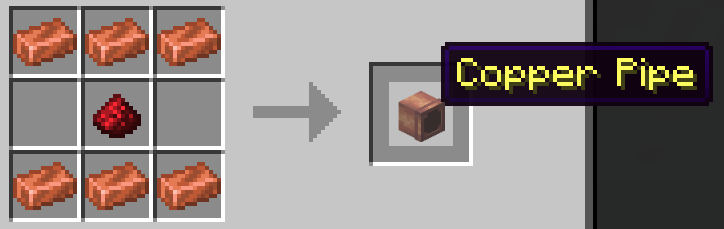
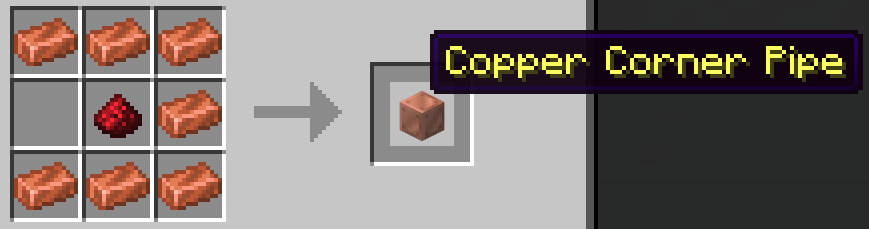

# Pipes

A Minecraft Paper plugin that adds pipes for transferring items between containers.

<!-- [Download on Modrinth](https://modrinth.com/plugin/pipes) -->



# Features

Pipes transfer items from a container to other containers, or spit them out like a dropper.

**Regular Pipes** pull items from the container behind them and push items forward. They face away from the block you place them against.

**Corner Pipes** only relay items - they don't pull. Use them to change the direction of item flow. They face toward the block you place them against.

Pipes can be chained together to create complex item transport networks.

Pipes come in different material variants (oxidized copper, copper, iron, gold) that affect transfer speed and visual appearance. Textures, variants, crafting recipes, and transfer settings are all configurable.



## Crafting

|                     Regular Pipe                      |                         Corner Pipe                         |
| :---------------------------------------------------: | :---------------------------------------------------------: |
|  |  |

Other pipe variants are crafted with their respective ingots. Oxidized copper pipes are made by throwing regular copper pipes into water cauldrons, or by crafting with a water bucket. Recipes are fully configurable.


## Commands

| Command                 | Description                       | Permission         |
| ----------------------- | --------------------------------- | ------------------ |
| `/pipes give <variant>` | Give a pipe item                  | `pipes.give`       |
| `/pipes reload`         | Reload configuration              | `pipes.reload`     |
| `/pipes recipes`        | Unlock all pipe recipes           | `pipes.recipes`    |
| `/pipes info`           | Info about currently loaded pipes | `pipes.info`       |
| `/pipes delete_all`     | Delete all pipes **(dangerous)**  | `pipes.delete_all` |
| `/pipes cleanup`        | (debug) Remove orphaned entities  | `pipes.cleanup`    |

## Configuration

The plugin is configured via `config.yml`. Each pipe variant can have custom settings:

```yaml
variants:
  copper_pipe:
    behavior: REGULAR
    display-name: "Copper Pipe"
    texture-set: copper
    transfer:
      interval-ticks: 10    # Transfer every 0.5 seconds
      items-per-transfer: 1 # Move 1 item at a time
```
